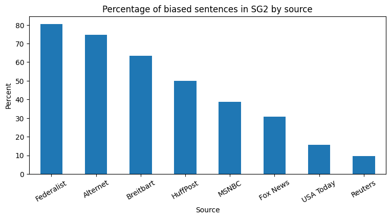

# Wikipedia Bias Detection — MayCodePudding

This project analyzes ideological bias in Wikipedia articles using a custom-trained machine learning pipeline based on expert-labeled political data. It removes internal metadata like publisher or article topic to ensure predictions work reliably on scraped Wikipedia content. The model is trained on data from the BABE Media Bias Dataset and uses interpretable features derived from the text itself.

---

## 📌 Project Goal

Wikipedia content is often edited by the public, making it vulnerable to unintentional political or ideological bias. This project aims to:

- Train a robust, interpretable model on expert-labeled bias data
- Predict sentence-level bias across any Wikipedia article
- Generate a full-article bias score based on those predictions
- Support scalable scraping and analysis for entire topics

---

## 🚀 Key Features

  - Trained on SG1, SG2, and MBIC datasets
  - SG2 is the primary dataset, but SG1 and MBIC are compared in separate analyses
  - Uses `combined_text` (sentence + headline) and `lexicon_match_count`
  - Removes `outlet`, `topic`, `type`, and `label_opinion` for real-world generalization
- End-to-end pipeline using `TfidfVectorizer`, `StandardScaler`, and `LogisticRegression`
- Sentence-by-sentence bias prediction with probability scoring
- Wikipedia scraping and sentence tokenization built in

---

## 📂 Datasets Used

- `final_labels_SG2.csv` — 3,673 political statements labelled by 5 experts
- `final_labels_SG1.csv` — 1,700 political statements labelled by 8 experts
- `final_labels_MBIC.csv` — 1,700 political statements labelled by crowdsourcers
- `bias_word_lexicon.xlsx` — Bias-related terms for lexical feature
- `news_headlines_usa_biased.csv` & `news_headlines_usa_neutral.csv` — To enrich sentence context

Dataset source:
- https://www.kaggle.com/datasets/timospinde/babe-media-bias-annotations-by-experts
- https://aclanthology.org/2021.findings-emnlp.101.pdf

An example insight derived from SG2 shows how certain news outlets vary in their proportion of biased sentences:

<p align="center">
  
</p>

This chart demonstrates how the model and dataset together reveal trends in media tone, even before applying it to Wikipedia articles.

---

## 📊 Final Model Performance

- Logistic regression model with TF-ID vectorizer
- Model trained on SG2: ROC-AUC = 0.809
- Model trained on SG1: ROC-AUC = 0.751
- Model trained on MBIC: ROC-AUC = 0.725

The SG2 dataset was the largest and had the most balanced classes, explaining its relatively high performance.

---

## 👥 Team

This project was created by:

- [**Randy Overbeek**](https://github.com/uberbeek) – TripleTen Data Science Graduate
- [**Eli Adams**](https://github.com/betanight) – TripleTen Data Science Graduate
- [**Ken Klabnik**](https://github.com/kenklabnik) – TripleTen Data Science Graduate

Team name: *Totally Bias*

---

## 🔍 Try It Out

To test the model on a live Wikipedia article:

```python
results = predict_bias_from_article("Donald Trump", pipeline)
print(f"Bias Score: {results['bias_score']} ({results['biased_sentences']} of {results['total_sentences']} sentences)")
```

---

## 🖥️ How to Run the Project Locally

1. **Clone the repo**
```bash
git clone https://github.com/your-username/MayCodePudding-Randy.git
cd MayCodePudding-Randy
```

2. **Set up a virtual environment**
```bash
python3 -m venv venv
source venv/bin/activate  # Windows: venv\Scripts\activate
```

3. **Install the requirements**
```bash
pip install -r requirements.txt
```

4. **Launch Jupyter Notebook**
```bash
jupyter notebook
```

5. **Open and run** `notebooks/main_project.ipynb`

---

## ✅ Requirements

- Python 3.8+
- pip
- Jupyter Notebook

---
